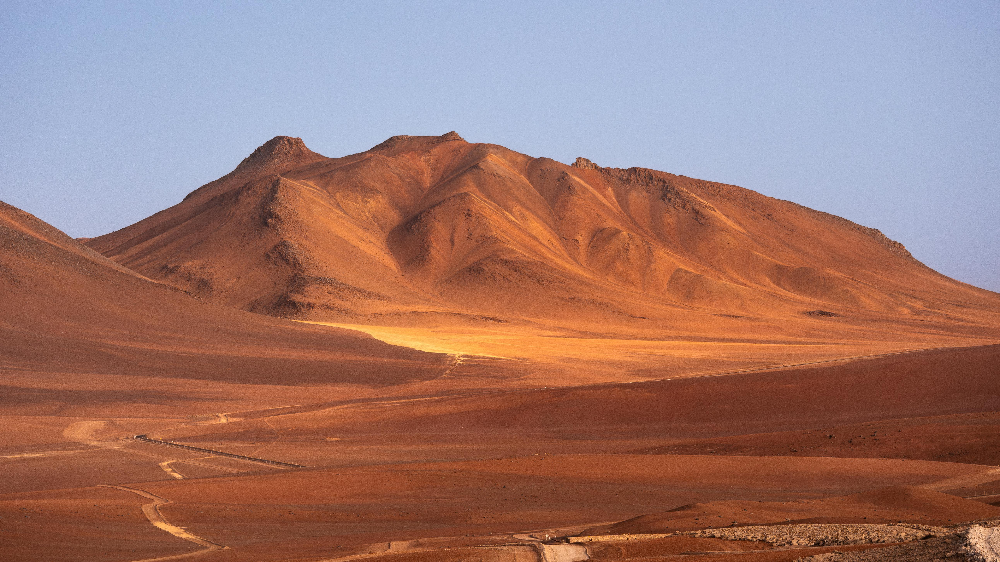

# A Global Map View of Textile Waste 

  
   
  
<em>Photo by <a href="https://www.pexels.com/photo/barren-mountain-in-the-desert-26558824/">Marek Piwnicki from Pexels</a></em>

   

Inspiration for this project can be found around 8,000km (50,000 miles) from New York City. In between the dry sands of the Atacama desert in Chile, the **"Cemetery of Clothes"** is a colorful man-made dumping ground comprised of worn clothing, textiles, and accesories.   

Leveraging data form the International Trade Center (2015 - 2024), this project visualizes global worn clothing exports and the network between the top five exporting countries and their destinations.
____
## **App Characteristics:**
* Interactive mapping and data visualization
* Data-driven storytelling
* Filtering options by country and/or year
* More ideas in development (graphs, local environmental news, and more maps!)
 
**🖥️Access Streamlit App:** https://textilewaste.streamlit.app/  
**📄Preview in PDF:** [Click here to view the App Preview PDF](app_preview.pdf)Textile Waste and Fast Fashion · Streamlit.pdf 
____
<a href="https://www.trademap.org/Country_SelProduct_TS.aspx?nvpm=1%7c%7c%7c%7c%7c6309%7c%7c%7c4%7c1%7c1%7c2%7c2%7c1%7c2%7c1%7c%7c1">Data Source here</a>
